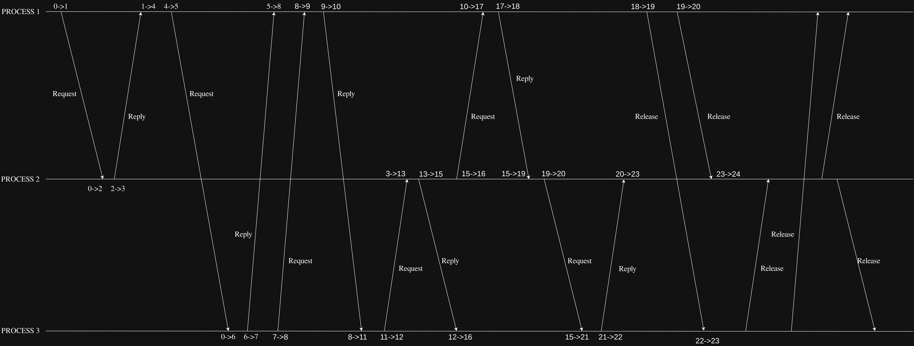

# Lamport Logical Clock
As per the instruction given we created two threads one is ServerThread and another is a ClientThread 

## Purpose of
    1. ServerThread:
        1. It creates a socket and attaches it to a given port eg:8081. 
        2. Server continously runs a while loop accepting connenction from other
            process so that  other process can make request for resources and
            after succesful request then add the {processId,timestamp} in to the
            requestQueue and we reply ok to it.   

    2. ClientThread
        1. Basically runs a local event inside in a while at a random interval
            using sleep(rand()). It runs local event exactly `callLimit` number of
            times.
        
        2. Before running the local event that is accessing the text file which is 
            our critical section, its makes a request to other process to update 
            their requestQueue so that other process know that this process is
            trying to access the ciritical section.

        3. After getting a succesful reply from other process as 'ok' we run a 
            while loop which continously checks if the element in top of
            requestQueue has same pid as the process's pid .if it is the same it
            breaks the loop and runs the critical section.

        4. After running the critical section it pops the element from its own 
            requestQueue and then sends a request to other process to inform them
            regarding this so they also can pop from the requestQueue.

        5. Now we go back again to step one.

## Basic Lamport Logical Clock Algorithm

- ### LOCAL EVENT
    ```
    logicalClock++;
    /*
        then do Local event
    */```

- ### SEND EVENT 
    ``` 
    logicalClock++;
    /*
        then do SEND event
    */
    ```
- ### RECEIVE EVENT 
    ```
    /*
        then do RECEIVE event
    */
    logicalClock = max(logicalClock,Timestamp_fromRecv)+1
    ```


## Our working
    what we have done is create 3 process named lamport.cpp, lamport2.cpp,
    lamport3.cpp.Since each of the file has their own PORT at which they run
    server lamport.cpp is given 8081 similarly lamport2,cpp is given 8082 and
    lamport3,cpp is given 8084

    we also have defined callLimit in each of the file specifying how many each
    file will run its local event

    since client of each file needs to talk to server of other two process for 
    sending request for resource we have defined three variables PORT1,PORT2,
    PORT3 where PORT1 is the port that process server itself and PORT2 and PORT3
    are other processes PORTS 

    for push and pop from requestQueue for accessing the critical section we have 
    created a seperate function that uses a mutex(binary semaphores) for making 
    these operation atomic and avoiding race condition since the requestQueue is 
    accesssed by both serverThread and clientThread

    Similarly for lamportClock to increment it we have used semaphores to avoid 
    race condition 

### To Run Program 
```
    # Open up three terminals and run these separate files also minimum time for 
    which each process will wait Before starting a ClientThread so within this 
    time all the 3 process must be started

    # Please remove all the data from critical_section.txt before running this 
    Program

    - 1st terminal
    $> g++ lamport.cpp -o lamport && ./lamport 
    
    - 2nd terminal
    $> g++ lamport2.cpp -o lamport2 && ./lamport2
    
    - 3rd terminal
    $> g++ lampor3.cpp -o lamport3 && ./lamport3 

``` 

## Example Screenshot



